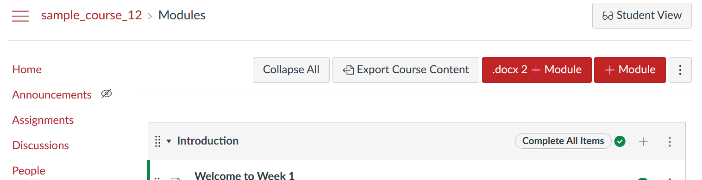

# Word to Canvas (```word2canvas```) Module

## What is ```word2canvas```?

A [userscript](https://en.wikipedia.org/wiki/User_script) that will create a new [Canvas LMS](https://www.instructure.com/en-au/canvas) module from a Word document (using some specific Word styles) - see [sample w2c.docx](./https://github.com/djplaner/word-to-canvas-module/raw/main/sample%20w2c.docx) for an annotated example.

> :exclamation: The contents of your Word documents always remain on your computer, your web browser, and eventually as a Module in the Canvas instance you are working with.

## Why use ```word2canvas```?

Manually creating a complex module using the Canvas web interface can be a touch tedious. Each item must be edited on its individual page. Multiple clicks... Especially if you already have the module content in a Word document and/or you are creating many modules. (e.g. migrating from one LMS to another)

## Why not?

1. Doesn't handle images embedded in Word documents.

   The Canvas editor [removes base64 encoded images from HTML](https://community.canvaslms.com/t5/Canvas-Question-Forum/base64-Images-Not-Displaying-in-Course-Pages/td-p/464739). The method ```word2canvas``` uses to convert the Word document to HTML converts images to base64 encoded images. The [current suggested "solution"](./docs/warnings/htmlConversion.md#base64-images) requires manual saving of these images and using them to replace placeholder images via the Canvas RCE. 

2. Required to use very specific Word styles.

   Your Word document must [use very specific styles](https://github.com/djplaner/word-to-canvas-module/blob/main/docs/create.md#summary-word-2-canvas-styles-and-their-purpose) to correctly create Canvas Modules and their items. There is a learning curve involved.

2. Doesn't work for [new Quizzes](https://community.canvaslms.com/t5/Canvas-Question-Forum/QUIZZES-NEXT-API/m-p/140850/highlight/true#M56387).

   Entirely because Canvas does [not yet have an API for new Quizzes](https://community.canvaslms.com/t5/Canvas-Question-Forum/QUIZZES-NEXT-API/m-p/140850/highlight/true#M56387).


## How to use ```word2canvas```

1. [Install the userscript](docs/getting-started/install.md) 

   Install a userscript manager (e.g. [TamperMonkey](https://www.tampermonkey.net/)) on your browser of choice and then install the [word-2-canvas userscript](https://github.com/djplaner/word-to-canvas-module/raw/main/release/word2canvas.user.js).

2. [Test the userscript](./docs/test.md)

   By creating a module from the sample Word document.

3. [Create a Word document](./docs/create.md) containing content for your new Canvas module.  
4. Visit the modules page of a Canvas course and [use word-2-canvas](docs/getting-started/use.md) to create a new module.

> :grey_question: Feel free to use this [repo's Issues](https://github.com/djplaner/word-to-canvas-module/issues) to ask questions. Especially in these early development stages.



## Current Status

> **Note:** :warning: ```word2canvas`` is largely working and is being used. There remain some rough edges and missing features.

Currently creates Canvas modules including
- Creating new: pages, sub-headers, and external urls.
- Links to existing: pages, assignments, files, discussions, quizzes (only old quizzes), and external tools.

## To be done

1. Better error checking and messaging
3. Figure out how to [handle embedded images](https://github.com/djplaner/word-to-canvas-module/issues/28).

## :warning: Known issues

1. The word-2-canvas button may not always appear on the Modules page.
   **Solution:** Reload the modules page. **Apparent cause:** Navigation between pages in a Canvas course doesn't always invoke word2Canvas to check if it's on the module page. A reload of the modules page forces the issue

   :warning: It appears that this is a particular problem when using Firefox. Chromium-based browsers (e.g. Chrome and Edge) appear to work better.

## Development

- Uses [mammoth.js](https://github.com/mwilliamson/mammoth.js/) for Word to HTML conversion

### Userscript

For local development it is suggested to

1. Use Chrome, with TamperMonkey installed and configured [to allow local file acess](https://www.tampermonkey.net/faq.php#Q204).
2. Install the [dev userscript](./dist/devWord2Canvas.user.js) version of the userscript.
3. Modify the dev script updating the local file: require to match the path on your computer.
