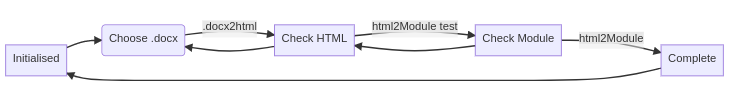

# Design

As illustrated below, the application has 5 states:

1. ```Initialised``` - the ".docx + Module" button has been added to the Canvas module page.
2. ```Choose Word``` - user is able to select the Word document.
3. ```Check HTML``` - results of the .docx to HTML conversion is provided for checking.
4. ```Check Module``` - the proposed HTML to Canvas Module conversion is provided for checking.
5. ```Complete``` - display the results of creating the new module

Beyond the tranisitions shown in the image below, there is a _cancel_ transition that returns to the ```Initialised``` state from any of the other states.





## Architecture

### Controller - state management

The [```c2m_Controller``` class](../src/c2m_Controller.js) manages application state and transitions between.

The controller is responsible for:

- Knowing what the different states are.
    Constants defined in the controller are used as labels to identify the current state.
- What current state is
    The ```currentState``` property.
- How to render the different states and perform additional tasks.
    Achieved by using state specific views.
- extracting canvas token

### Views - representation

Each state has its own view


### Data structures

- Different states are represented using an enum defined in the model source.
    - ```c2m_initialise```
    - ```c2m_chooseWord```
    - ```c2m_checkHtml```
    - ```c2m_checkModule```
    - ```c2m_c2m_complete```
- Current state is stored in the model ```model.stage```

### Algorithms

Basic operation
1. Model 
    - created with stage set to ```c2m_initialise```
2. View 
    - passed the model
    - calls ```render``` - a big switch statement that then calls stage dependent method: ```renderInitialise renderChooseWord renderCheckHtml renderCheckModule renderComplete```

Event handling 

- event handlers are created by the different render functions, including any required click events
- each click event is a call to the views ```handleClick``` method accepting a stage enum
- ```handleClick``` - selects the specific event handler based on the stage enum

#### Example

When first run, the view will call ```renderInitialise```, which will - if there's already an add_module button on the page - 
1. add the ```c2m_word_2_module``` button with onclick ```handleClick(c2m_chooseWord)
2. remove the ```c2m_dialog``` div if it exists (i.e. user closed an existing conversion)


