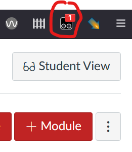

# Diagnosising and fixing issues

A short (but growing) list of questions that may help you diagnose issues with ```word2canvas```

## Is your userscript manager turned on?

Userscript managers (e.g. TamperMonkey) can be turned on or off. If it is off, then the userscripts are not executed. Nothing will happen.  Most userscript managers add an icon to your browser to indicate status (e.g. is it on) and to configure how it works.

You may need to refer to your userscript manager's documentation to discover how to make it's icon visible on your browser.

The followint table illustrates the difference between TamperMonkey being 

- on - the TamperMonkey icon is a dark colour and if there are active userscripts it will show how many.
- off - the TamperMonkey icon is greyed out.

| TamperMonkey On | TamperMonkey Off |
| ---------------- | ---------------- |
| | |

Clicking on the UserScript manager icon will typically provide a way to turn it on or off.

| TamperMonkey On | TamperMonkey Off |
| ---------------- | ---------------- |
|   |  |

## Is the ```word2canvas``` userscript installed?


## Is the ```word2canvas``` userscript enabled?