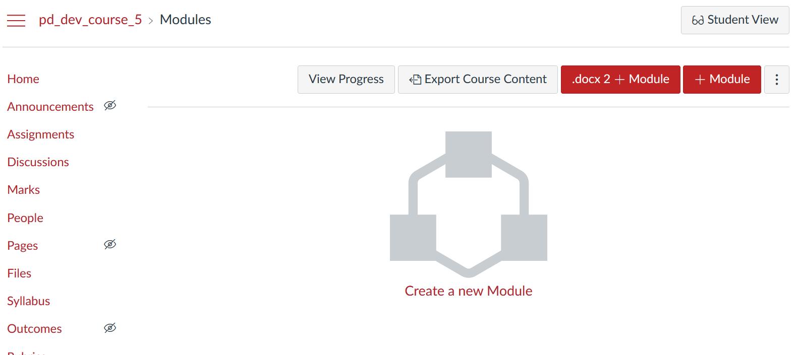
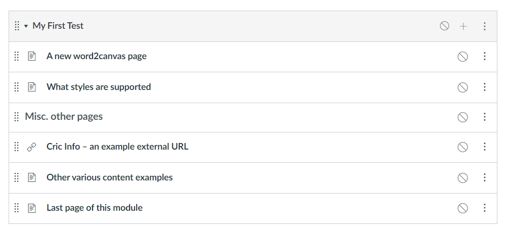

# Testing ```word2canvas```

There is a 3-step process to test ```word2canvas```:

1. [Prepare pre-requisites](#1-prepare-pre-requisites)

2. [Check that ```word2canvas``` is active](#2-check-that-word2canvas-is-active)

3. [Use ```word2canvas``` with a sample Word document](#3-use-word2canvas-with-a-sample-document)

!!! Note "Another example"

    The ["sample Word document" walk-through](../walk-throughs/using-the-sample.md) is a screencast of the steps below using the [sample w2c.docx document](../../sample%20w2c.docx)

## 1. Prepare pre-requisites

To test ```word2canvas``` you will need

1. A browser with the ```word2canvas``` userscript installed.
2. A Canvas course site on which you can create Modules.
3. Have downloaded the [firstTestDocument.docx file](https://github.com/djplaner/word-to-canvas-module/raw/main/docs/firstTestDocument.docx) to your computer.

## 2. Check that ```word2canvas``` is active

With ```word2canvas``` installed in your browser, go to the Modules page of your Canvas course. **Not** in _Student View_. You should see something similar to the following.



The new addition is the **.docx 2 + Module** button to the left of the **+ Module** button in the top right-hand corner. This button has been added by ```word2canvas```.

If you don't see this button, there is a problem that [needs to diagnosed and remedied](../limitations/diagnosis.md)

## 3. Use ```word2canvas``` with a sample document

Create a new module by clicking the **.docx 2 + Module** button. This should add the **.docx 2 + Canvas Module** interface at the top of the page you're viewing. e.g. the following image.

Use the _Browse_ button to select the ```firstTestDocument.docx``` file you downloaded. Follow the advice shown and your module should be created and you'll end up with something like the following.

