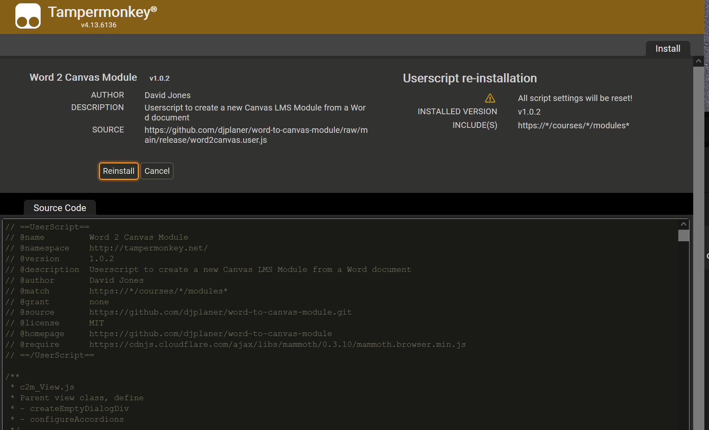
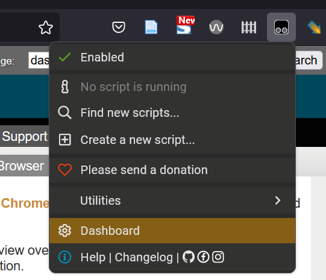
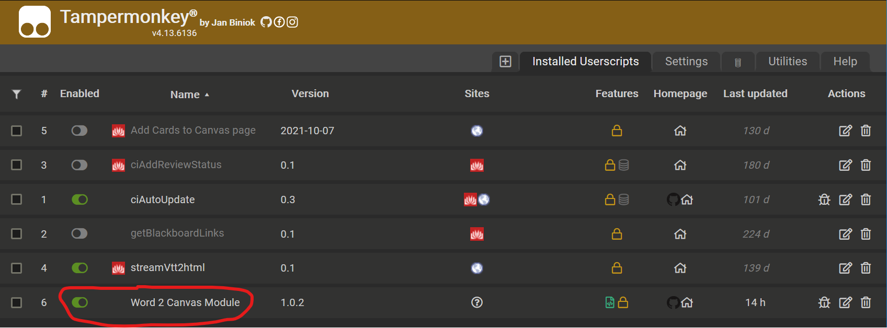

# Install word-2-canvas

```word-2-canvas``` is written as a [userscript](https://en.wikipedia.org/wiki/Userscript). A small program that is installed on your web browser and only run when you view specific web pages.  

> :exclamation: Userscripts are installed in the browser you are using. If you move to another computer or use a different browser, the userscript will not work on that different browser. You need to install the userscript (and the userscript manager) on each browser you use.

```word-2-canvas``` is designed to run whenever you view [the Modules page](https://community.canvaslms.com/t5/Instructor-Guide/How-do-I-use-the-Modules-Index-Page/ta-p/926) of the Canvas LMS. Userscripts customise web pages to better suit your purposes. e.g. to help you create a Canvas module from a Word document.

There are two steps to installing ```word-2-canvas``` explained here:
1. Install a userscript manager (if you haven't already).
   :question: You install a [userscript manager](https://en.wikipedia.org/wiki/Userscript_manager) into your web browser (not surprisingly) to manage userscripts. 
1. Install the ```word-2-canvas``` userscript

## 1. Install a userscript manager

If you don't already have a userscript manager installed, you can install one from [TamperMonkey](https://www.tampermonkey.net/).  [TamperMonkey](https://www.tampermonkey.net/) is a widely used userscript manager. It can be used on most modern web browsers. 

There is [video showing how to install TamperMonkey](https://www.tampermonkey.net/faq.php#Q100).

### 1.1. Visit the [Tampermonkey home page](https://www.tampermonkey.net/).

You should see instructions for downloading (installing) TamperMonkey for your web browser. e.g. the following image for the Firefox browser


### 1.2. Click on the left-hand _Download_ button

As shown above, you can choose to download the stable (left-hand download button) version of TamperMonkey or the BETA (right-hand download button) version. The stable version is recommended.

You will be taken to your web brower's [extension or add-on service](https://en.wikipedia.org/wiki/Browser_extension).

### 1.3. Follow the instructions to add Tampermonkey to your web browser

Each web browser’s browser extension installation process will be a little different. In general, it will provide you with details of what permissions the browser extension (Tampemonkey in this case) wishes to have and provides you with the option to install.

## 2. Install the word-2-canvas userscript

With TamperMonkey installed you can now install [the word-2-canvas userscript](https://github.com/djplaner/word-to-canvas-module/raw/main/release/word2canvas.user.js). Just click on that link.

If all is working you should something like the following image. An image showing TamperMonkey providing you with details of the userscript and asking if you wish to install it.



## 3. Turning word-2-canvas off

There are two ways to prevent word-2-canvas from modifying your view of Canvas modules pages:
- Disable or [remove](https://www.tampermonkey.net/#removal) TamperMonkey 
- Disable the word-2-canvas userscript by accessing the TamperMonkey dashboard and disabling ```Word 2 Canvas Module``` (see below)





## 4. Testing word2canvas

The next step is to [test ```word2canvas```](./test.md) with Canvas.