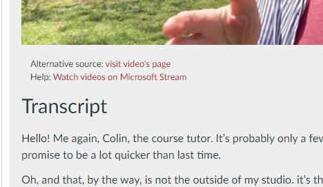
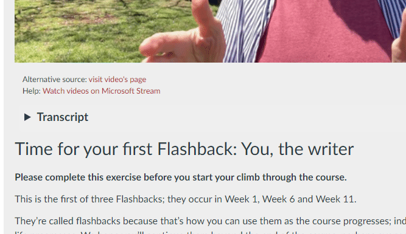

# h2 as accordions

By default all _Heading 2_ styles will become standard HTML `<h2>` elements. 

  

If the `h2-as-accordions` option is checked, they will be converted into accordions. i.e. all content from the h2 until the next h2/h1 or the end of the page will be hidden from the reader.

