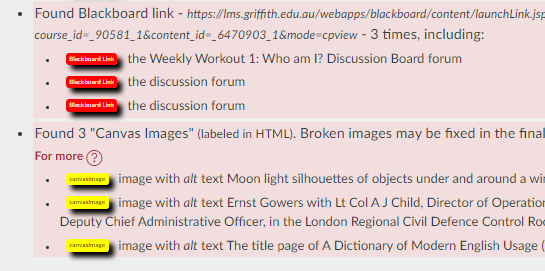
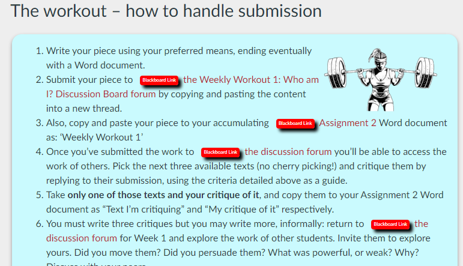
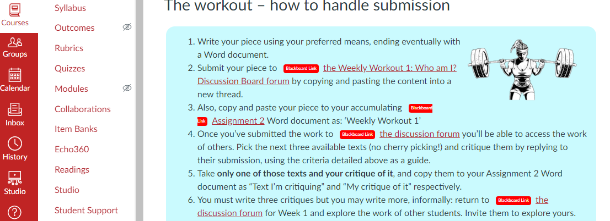

# Keep error labels in Canvas content

During the conversion process ```word2canvas``` will generate a number of errors and warnings. These identify possible issues with the conversion process that may require manual intervention.

By default these labels are NOT included in the content added to Canvas. If turned on this option will include the error labels in the generated Canvas content. The purpose being to make it easier for you to identify what needs to be fixed.

## _Check HTML_ stage error labels 

During the _Check HTML_ stage ```word2canvas``` will generate warnings and errors about the conversion process. These are visible both in the _Messages_ and _HTML_ panels.

### _Messages_ panel

For example, the following shows three warnings and three warnings. Click on the labels and you will see the error/warning within the HTML content.

  

### _HTML_ panel

The _HTML_ panel displays the full HTML generated by the conversion process. Error labels are added into the HTML in close proximity to the source of the error.

  

## Errors kept in Canvas

If you check the _Keep error labels_ option, the error labels will be included in the Canvas content.

  