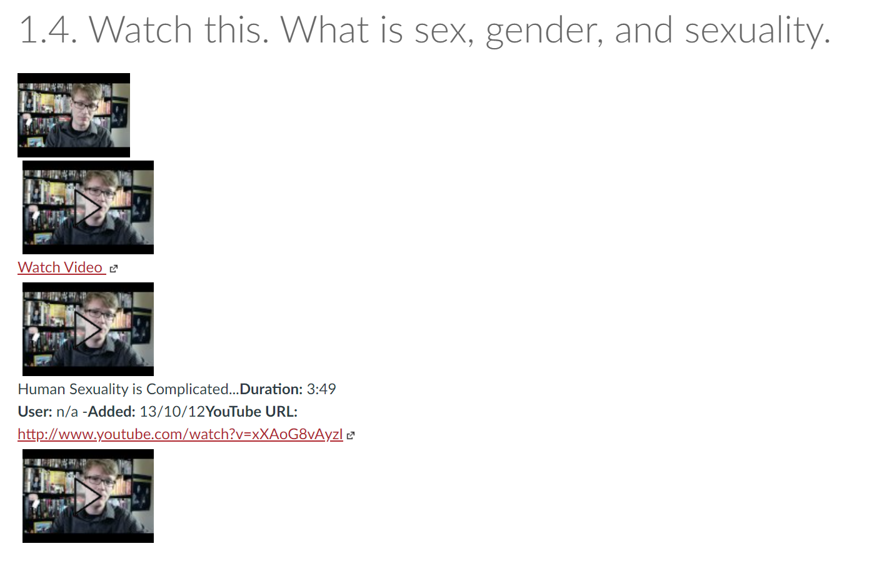
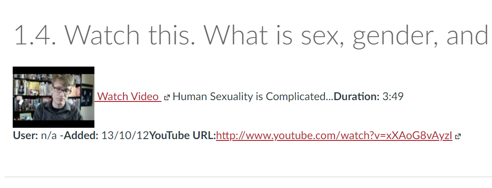

# Disable inline Youtube previews

When content is not entered via the Canvas Rich Content Editor, Canvas will automatically embed a video preview whenever it sees a link to a YouTube video (and perhaps other video services). This can break the design intent. e.g. [this problem and solution](https://community.canvaslms.com/t5/Canvas-Question-Forum/How-can-I-disable-embedded-video-previews/m-p/156170) from the Canvas Community.

By turning on the "Disable inline Youtube previews" option, this behavior will be disabled.

## Example - Inline Youtube previews enabled

  

## Example - Inline Youtube previews disabled

Same page as above, but with the "Disable inline Youtube previews" option turned on.

  