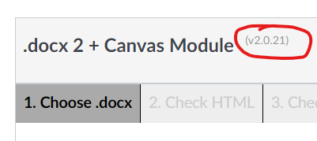

# Reference overview

## Latest version - v2.0.19

The latest version of ```word2canvas``` is v2.0.19. This version is available from the [Install ```word2canvas``` page](../getting-started/install.md).

  

## Overview of supported MS Word Styles

[MS Word styles](./word-styles.md) are used to specify what and how ```word2canvas``` converts the content of a Word document into a Canvas module. 

## Available options

How ```word2canvas``` converts a Word document into a Canvas module can be modified through the use of options, including:

- [Keeping error labels](options/keep-error-labels.md)
- [H2s as accordions](options/h2-as-accordions.md)
- [Disabling inline youtube previews](options/disable-inline-youtube-previews.md)

## Warnings and how to handle them

```word2canvas``` will [generate various warnings](warnings.md) whilst generating a Canvas module.
