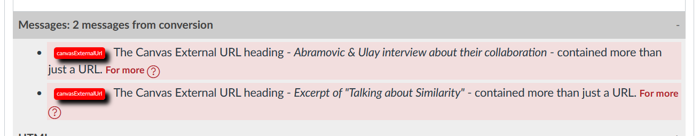

# Warnings (and maybe how to fix them)

## About warnings

```word2canvas``` will detect issues with the conversion from Word to a Canvas module and attempt to generate meaningful warnings. These warnings will often include links to this documentation for more information and advice on how to remedy the potential issue. 

The following image is one example. In this case the two warnings provided are of the same type.

  

## Current Warnings

Warnings can be grouped by the following different types.

### Fatal errors

```word2canvas``` depends on certain basic content to be present in the Word document being converted. Their absence will create [a fatal error](warnings/fatalErrors.md), meaning that ```word2canvas``` will not proceed any further with the conversion.

### Failed Word Style

```word2canvas``` relies on Word styles to determine how to convert the content of a Word document into a Canvas module. There are times when [```word2canvas``` can file to handle Word styles](warnings/failedWordStyles.md)

### HTML Conversion Problems

```word2canvas``` converts Word documents to HTML and then to Canvas modules. There are times when [there are problems with HTML conversion](warnings/htmlConversion.md). Currently, the document problems includes:

- [base64 conversion issues](warnings/htmlConversion.md#base64-images) - This is actually an issue with Canvas not supporting base64 images in the HTML editor.

### External URLs

[External URLs](warnings/externalUrls.md) are a type of Canvas module item. There are two common warnings associated with external URLs:

1. [No valid URL is provided](warnings/externalUrls.md#no-valid-url-is-provided)
2. [More than a URL is provided](warnings/extenalUrls.md#more-than-a-url-is-provided)

### Images

The ability of ```word2canvas``` to work with images is "complicated". The [Canvas Images page](warnings/canvasImages.md) provides more detail, including coverage of problems.


