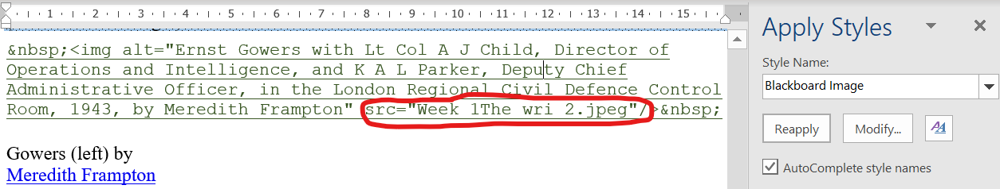
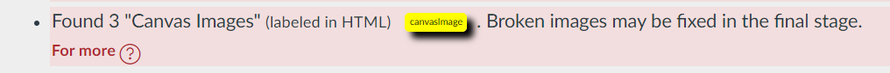
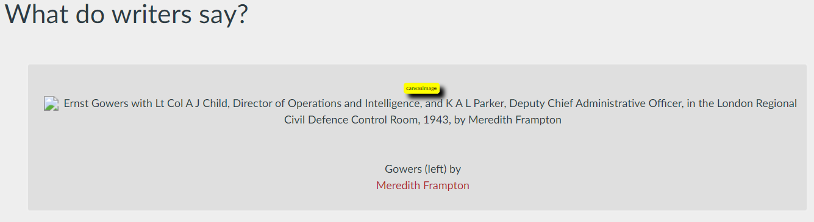
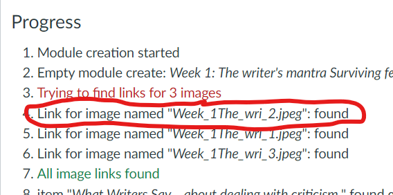
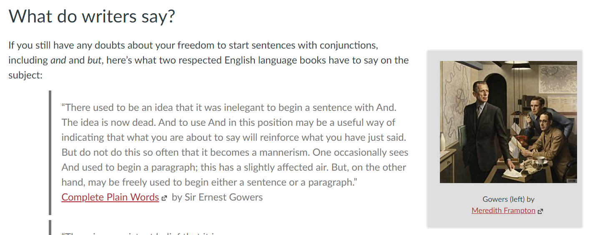

# Canvas (and Blackboard) Images

## Why?

_Blackboard Images_ and _Canvas Images_ are a method for ```word2canvas``` to include images in a Canvas page where 

1. The image is located in the Canvas course's files area.  
2. But where only the name of the file is known (not the full URL as normally expected)

This is used by the CAR process when a Blackboard page uses a Blackboard image of a Base 64 encoded image. i.e. types of images that can't be directly imported into Canvas.

!!! info

    This workaround approach is required because

    1. Canvas doesn't support Base 64 encoded images in the HTML editor
    2. ```word2canvas``` isn't smart enough to translate base 64 encoded images into Canvas files.

## What it looks like?

### In the Word document

In the Word document you will see some HTML code that is green in colour and has the _Blackboard Image_ style applied. If you look closely, you will see that the ```src``` for the file is just a filename. e.g. the following

  

### ```word2canvas``` _Check HTML_ stage

During this stage, ```word2canvas``` will generate some warnings to identify the _Blackboard/Canvas Images_. This is necessary because at this stage you will not be able to see the images in the Canvas page. At this stage, ```word2canvas``` has not done any proocessing of the HTML (e.g. converting the filename into a full URL)

You will see these warnings in both the _Messages_ and _HTML_ sections.

#### Messages

_Messages_ will tell you the number of _Canvas Images_ found

  

#### HTML

In the _HTML_ section you will see small warning boxes indicating the specific _Canvas Images_. As you can see the image is broken - not showing. Since the URL for the image is just the filename.  This will get fixed later in the process.

  

### ```word2canvas``` _Complete_ stage

In the final stage ```word2canvas``` will try to find the proper URL for the image filename. During this stage it will tell you whether it succeeded or not. See the "possible problems" section below for more detail on what might go wrong.

The most common problem will be that the image file has not been loaded into the Canvas course's files area.

  

### In a Canvas page

After ```word2canvas``` is complete, you can go to the newly created page and check that the image is showing.

  

## Possible problems

1. The image filename does not match any file in the Canvas course' file area

    Suggesting that the filename has not been uploaded into the file area.

2. The image filename matches more than one file in the Canvas course' file area.

    ```word2canvas``` searches for just the filename. The file area may have more than one file matching that name spread across different folders.

## How it is meant work

"Canvas Images" are ```word2canvas'``` method for handling images from a Blackboard course that are hosted in the Blackboard content collection or Base 64 encoded images. 

It uses a two-step process:

1. Conversion to ```span.blackboadImage```

    The CAR process generates a Word document where such Blackboard images into a ```span.blackboardImage``` with the content collection URL converted into a filename.

2. Conversion to Canvas: ```span.canvasImage``` and link to Canvas' file area

    By step 2, ```word2canvas``` will convert the ```span.blackboardImage``` into a ```span.canvasImage```. At this stage, the image will likely be broken as it is using a bare filename. By step 4, ```word2canvas``` will find a matching filename in the course files area, generate a URL for the image, and update the ```span.canvasImage``` to use that URL
