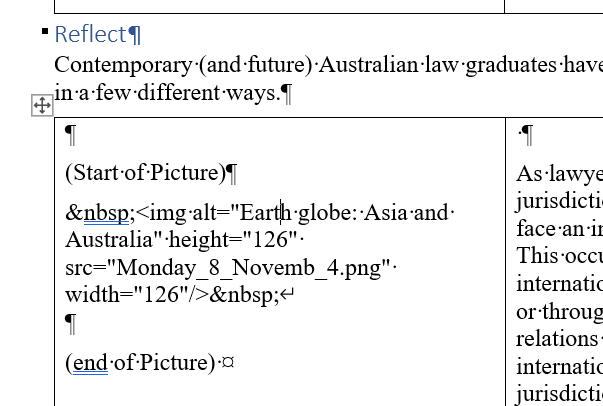
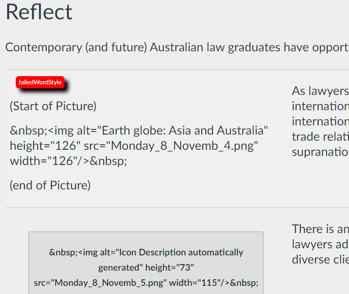

# Failed Word Styles 

## Why?

The Word documents generated by the CAR process seeks to apply specific Word styles to enable conversion.  Sometimes this fails and this will impact the conversion.

Some of the failed Word styles will leave artefacts indicating failure. A ```Failed Word Style``` error indicates that one of these artefacts has been detected.

## Example Word doc failed style

For example, the following image shows a Word document where the ```Picture``` styles has failed. This is indicated by the text ```(Start of Picture)``` and ```(End of Picture)``` without any colouring.

This is the most common failure, where an attempt was made by the CAR to apply the style within a table.

  

## Same example in Word2Canvas

The following image shows word2canvas' attempt to convert the document above, including the ```Failed Word Style``` error. Note the difference between the failure and the successs.

  