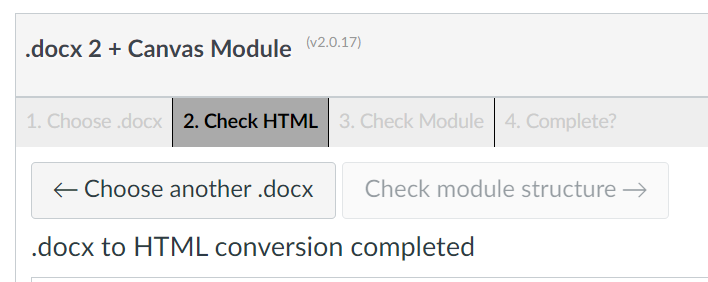
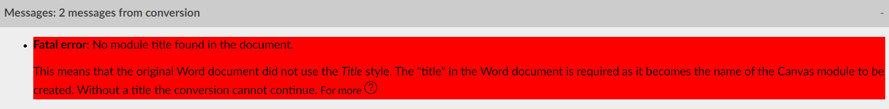
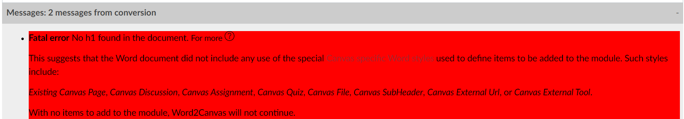
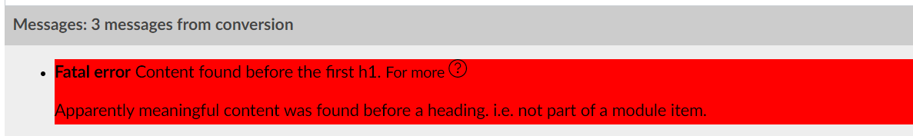

# Fatal Errors

Fatal errors occur during the initial conversion of the Word document to HTML. Such errors indicate that the Word document is missing critical content and that the conversion cannot proceed. The following summarises each of the fatal errors that can occur and their cause.

## Minimum requirements

For ```word2canvas``` to convert a Word document to a Canvas module, the Word document must have

1. A title which is used as the name for the Canvas module that will be created.
2. At least one item to add to the Canvas module.
3. No content that occurs before the first item.

## Fixing fatal errors

If a fatal error occurs you will not be able to continue the conversion. As shown in the following image the __Check Module Structure_ button will be disabled. To remedy this you will need to:

1. Use Word to fix the fatal error in the Word document.
2. Use the __Choose another .docx__ button to select the fixed Word document.

  

## Resulting fatal errors

### No title

The [special Word styles](../word-styles.md#canvas-specific-styles) recognised by ```word2canvas``` include the __Title__ style. Some text with the __Title__ style must be present in the Word document. If no text with the __Title__ style is present, the following fatal error will be generated.

  

### No module items

The purpose of ```word2canvas``` is to create a Canvas module with items from a Word document. If there are no items present the standard Canvas module creation process should be used.

Module items are identified by the use of a group of [different Word styles](../word-styles.md#canvas-specific-styles) matching the different types of items that can be added to a Canvas module. Each of these Word styles is based on the standard __Heading 1__ Word style. The model is that the __Heading 1__ text defines the title of the item and the text that follows is the content of the item. 

  

### Content before the first heading

Since headings define the module items, any content that occurs before the first heading is not part of any module item. Meaning it can't be added to the Canvas module. Potentially leading to some lost information.

  