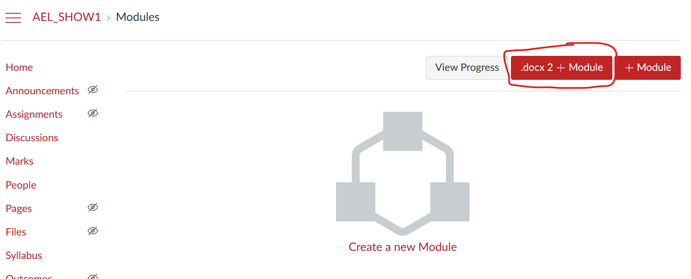
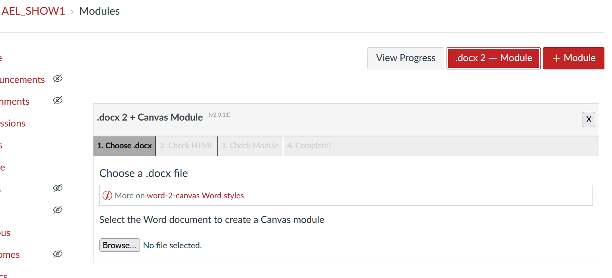
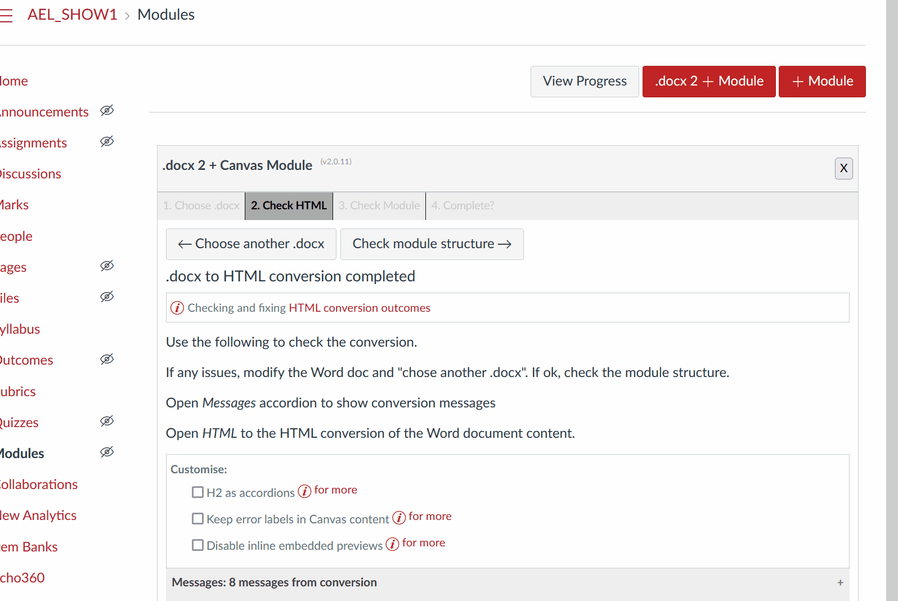

# Create a module

## Task

Use ```word2canvas`` to create a Canvas module using the [sample Word document](https://github.com/djplaner/word-to-canvas-module/raw/main/sample%20w2c.docx).

## Pre-requisites

1. Created a Word document with the content you require (e.g. the sample document) and wish to convert it to a Canvas module.
2. [Installed and test ```word2canvas```](../getting-started/overview.md)

## Process

Use these 5 steps to create a module with ```word2canvas``` 

1. [Go to the modules page of your Canvas course site](#go-to-the-modules-page-of-your-canvas-course-site)
2. [Choose your Word document](#choose-your-word-document)
3. [Check the HTML conversion](#check-the-html-conversion)
4. [Check (and eventually configure) the Canvas module](#check-and-eventually-configure-the-canvas-module)
5. [Create the module](#create-the-module)

### 1. Go to the modules page of your Canvas course site

```word2canvas``` creates a [module](https://community.canvaslms.com/t5/Canvas-Basics-Guide/What-are-Modules/ta-p/6) in your Canvas course site. ```word2canvas``` is only available from module page of your Canvas course site.

With ```word2canvas``` installed the modules page should include the ```.docx 2 + Module``` button in the top right hand corner - circled in red in the following image. This is the button to start using ```word2canvas```.

  

### 2. Choose your Word document

Clicking on the ```word2canvas``` button will add the ```word2canvas``` dialog to the page ready for you to browser for the Word document on your computer. As soon as you select the Word document ```word2canvas``` will upload, attempt to convert it to HTML and move onto the next stage.

  

### 3. Check the HTML conversion

After the HTML conversion is complete ```word2canvas``` will display the results in the form of

- messages, and

    A collection or warnings and errors detected during the conversion.

- HTML

    The contents of the Word document converted into HTML.

You can use this information to double check the conversion of your Word document. If there are issues you modify the Word document and try again. 

Assuming you are happy with the HTML conversion of your Word document you hit the ```Check module structure``` to move onto the next stage.


### 4. Check (and eventually configure) the Canvas module

In this stage ```word2canvas``` presents a representation of the Canvas module that will be created (it's not been created yet). This is an opportunity for you to check if the structure meets your intent.

If the structure doesn't meet your intent, then you will need to modify your Word document and start again.

If all is good hit the ```Create module``` button to move onto the next stage - the actual creation of the Canvas module.

!!! note "Coming soon"

    The current plan is that this stage will eventually allow you to configure aspects of the Canvas module. For example, indenting items and perhaps configuring completion requirements.



### 5. Create the module

As you enter stage 5 ```word2canvas``` interacts with Canvas to create the new module, this includes:

1. Creating the new module.
2. Looping through each item in the module and either creating a new item or finding an existing item (depending on the Word document and styles)
3. Updating any ```Canvas File Link``` or ```Canvas Image``` styles.

    These styles use names of files hosted in the Canvas files area. In this stage, ```word2canvas``` attempts to replace the names of the files with correct Canvas links.

```word2canvas``` generates a list of messages as it completes this process to report progress and any errors as they occur.

The most common errors are generated when ```word2canvas``` is unable to find Canvas items or files it expects to already exist. For example, the sample Word document attempts to link to a number of files, assignments, images, and discussion topics that don't exist in the sample course.

If there are errors you can either manually modify the created module using the Canvas interface, or you can remove the module and its items and start again by modifying your Word document.

If you are happy with the module, you can close ```word2canvas``` by clicking the "close" button.

