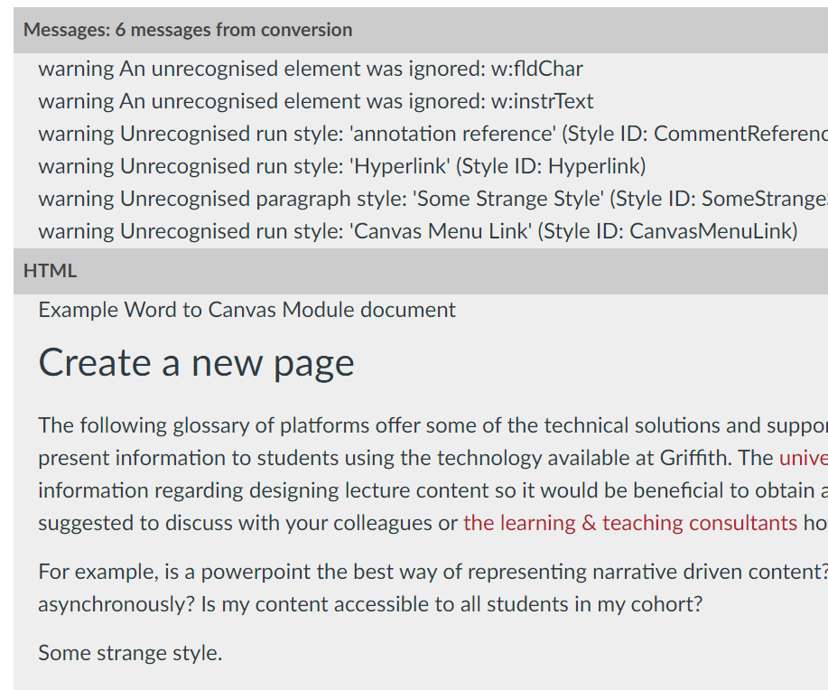

# Checking and fixing HTML conversion outcomes

## Background

The first step in ```word2canvas``` is converting your Word document to HTML. To achieve this, ```word2canvas``` uses 

1. the [Mammoth .docx to HTML converter](https://github.com/mwilliamson/mammoth.js#mammoth-docx-to-html-converter); and,
2. a [custom style map](https://github.com/mwilliamson/mammoth.js#custom-style-map).

After attempting to convert your Word document, ```word2canvas``` will display both the **Messages** and the **HTML** generated by Mammoth. These are displayed in accordions which can be opened/closed to check the outcomes of the conversion and inform how to fix any issues.

## Checking the conversion outcomes

The following image shows the conversion outcomes of [the sample w2c.docx file](https://github.com/djplaner/word-to-canvas-module/raw/main/sample%20w2c.docx). The two most common types of checks are

1. Do the **Messages** include anything of concern?
2. Are there any problems with the generated **HTML**?



### Check the **Messages**

Mammoth messages follow a [common format](https://github.com/mwilliamson/mammoth.js#messages), typically including a **type** and a **message**.

The **type** with be either a _warning_ or a _error_. Warnings tend to mean the conversion happened, but perhaps with unexpected results. 

As illustrated above the most common _warning_ indicates that the document includes a Word style that is not recognised by Mammoth.

### Handling unrecognised Word styles

There are three ways you can handle a Word style unrecognised by Mammoth

1. Ignore it - generally the text will still appear in the HTML. However, it may have lost some of the intended styling.
2. Remove the style from the Word document - you can [search Word documents for specific styles](https://wordribbon.tips.net/T011741_Searching_for_Styles.html) and then choose to apply a different style or to [remove the style entirely](https://support.microsoft.com/en-us/office/add-and-remove-styles-from-the-quick-styles-gallery-21c5b9de-b19e-4575-bc87-cb2b55ece224)
3. Add the style to the ```word2canvas``` custom map - the custom map is in the [word converter model](https://github.com/djplaner/word-to-canvas-module/blob/main/src/models/c2m_WordConverter.js). If you're not comfortable coding, you can request an update of the custom style map [via the ```word2canvas``` _Issues_](https://github.com/djplaner/word-to-canvas-module/issues).

### Handling problems with the generated HTML

If the generated HTML does not meet your expectations, the only real solution is to modify the Word document (e.g. change the style used, modify an image etc) and test the conversion again.