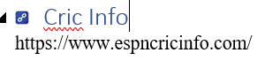
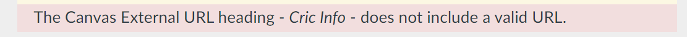
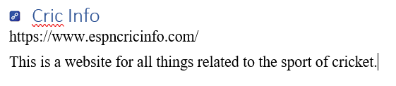
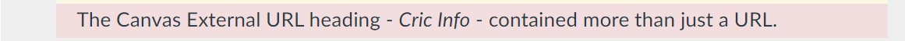
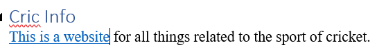

# Problems with Canvas External URLs 

```word2canvas``` supports the creation of an [external URL as a module item](https://community.canvaslms.com/t5/Instructor-Guide/How-do-I-add-an-external-URL-as-a-module-item/ta-p/967) via the _Canvas External Url_ Word style (based on the _Heading 1_ Word style). The _Canvas External URL_ style defines the title of the item. The content of the section following the _Canvas External URL_ style is the URL it should link to. For example



There are two common problems when using this style

1. No valid URL is provided; and,
2. More than a valid URL is provided.

## No valid URL is provided

A _Canvas External URL_ section must include a valid URL. The following image is an example of a _Canvas External URL_ section without a valid URL (it's missing the ```https://``` required at the start of a URL).


> **Note:** A valid URL means it meets [the standard](https://www.w3.org/TR/2011/WD-html5-20110525/urls.html#:~:text=A%20URL%20is%20a%20string,it%20has%20no%20query%20component.) for a web link (starting with https or http). It does not mean that there is something at the URL.

### Solution

Make sure the URL is a valid URL. Can you use it in a web browser to access a resource on the web?

```word2canvas``` will generate an error



## More than a valid URL is provided

If the section after the _Canvas External URL_ style contains a valid URL AND additional content. For example



```word2canvas``` will generate a "Canvas External URL heading...contained more than just a URL" error (e.g. the following image) 



### Two possible solutions

There are two possible solutions to this problem

1. Remove the additional content.

    e.g. return the section to the just the URL as shown in the image at the top of this page.
2. Use a new Canvas Page and include the link with the additional content. 

    The Canvas External URL item does not support additional content. A better fit is a Canvas Page with the link embeded into the content (not as the title). Change the style for the heading from _Canvas External URL_ to _Heading 1_ and then insert the link into the content appropriate (e.g. the following)


